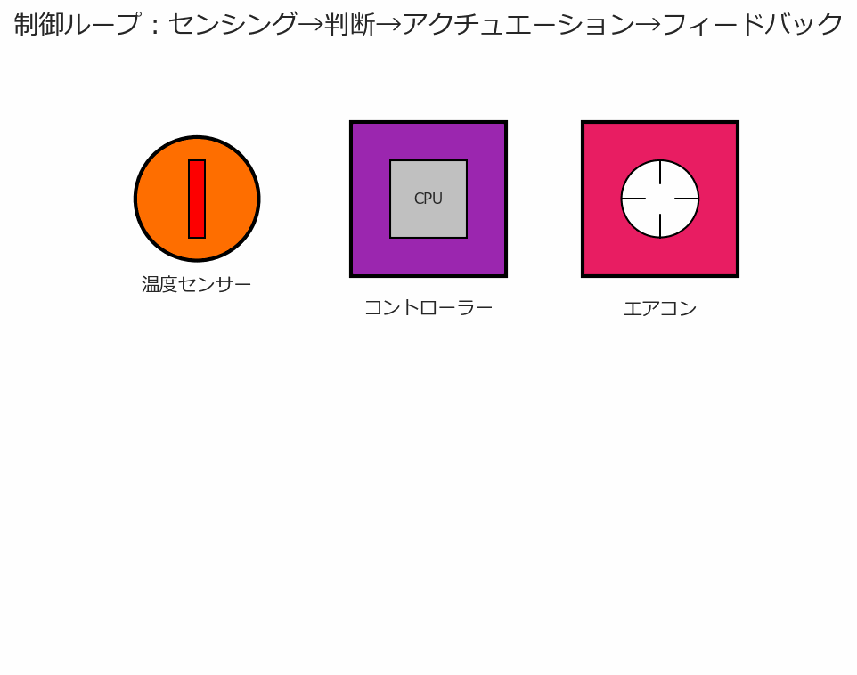

# 第1章: 組込制御ってなんだろう？ ～私たちの身近な「賢い」仕組み～

この章では、組込制御の基本的な概念を、身近な例を通じて理解していきます。

## 1.1 組込制御って、一体何のこと？

組込制御とは、特定の機器や装置に組み込まれたコンピュータが、その機器の動作を自動的に制御する仕組みのことです。

> 組込制御は「特定の目的のために機械に組み込まれた、賢いお世話係」のようなものです。
> 私たちが意識しなくても、裏で一生懸命働いてくれています。

例えば、エアコンが部屋の温度を自動で調整したり、炊飯器がお米を美味しく炊いてくれたり。これらはすべて組込制御のおかげです。

## 1.2 身の回りにある組込制御を探してみよう！

実は、私たちの生活は組込制御に囲まれています。朝起きてから夜寝るまで、どれだけの組込制御にお世話になっているか見てみましょう。

**図1-1: 身の回りの製品に組み込まれた制御システム**

<iframe src="../../charts/embedded_examples.html" width="100%"  style="border: 1px solid #ddd; border-radius: 4px;" scrolling="no" class="auto-height-iframe"></iframe>

!!! note "身近な組込制御の例"
    **家電製品**: 洗濯機（水量・時間の自動調整）、電子レンジ（加熱時間の制御）
    **自動車**: エンジン制御、ブレーキアシスト、エアバッグ
    **医療機器**: 体温計、血圧計、心電図モニター

## 1.3 組込制御システムって何ができるの？

組込制御システムは、基本的に「センシング」「判断」「アクチュエーション」の3つのステップで動作します。そして、結果を確認する「フィードバック」により、より正確な制御を実現します。

**図1-2: 制御ループの基本的な流れ（アニメーション）**

1. **センシング（感知）**: センサーで周囲の状況を把握（人間の五感に相当）
2. **判断（制御）**: 取得した情報を基に、どう動作すべきか決定（人間の脳に相当）
3. **アクチュエーション（実行）**: 判断に基づいて実際に動作（人間の手足に相当）
4. **フィードバック**: 実行結果を確認し、必要に応じて調整

## 1.4 まとめ：組込制御は「縁の下の力持ち」

組込制御は、私たちが普段意識することなく、生活を支えてくれている技術です。目立たないけれど、なくてはならない存在。まさに「縁の下の力持ち」と言えるでしょう。

!!! note "この章で学んだこと"
    - 組込制御は特定の機器に組み込まれた制御システム
    - 身の回りの多くの製品に組込制御が使われている
    - センシング→判断→アクチュエーション→フィードバックのサイクルで動作
    - 私たちの生活を便利で快適にする「縁の下の力持ち」

!!! info "次のステップ"
    - [第2章でITと組み込み技術の違いを学ぶ](chapter02.md)
    - [用語集で専門用語を確認](../glossary.md)
