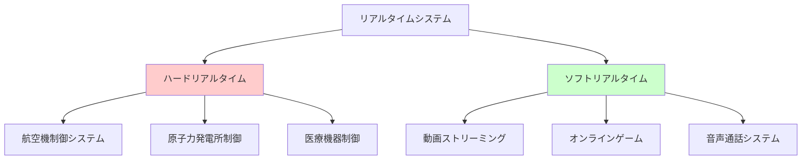
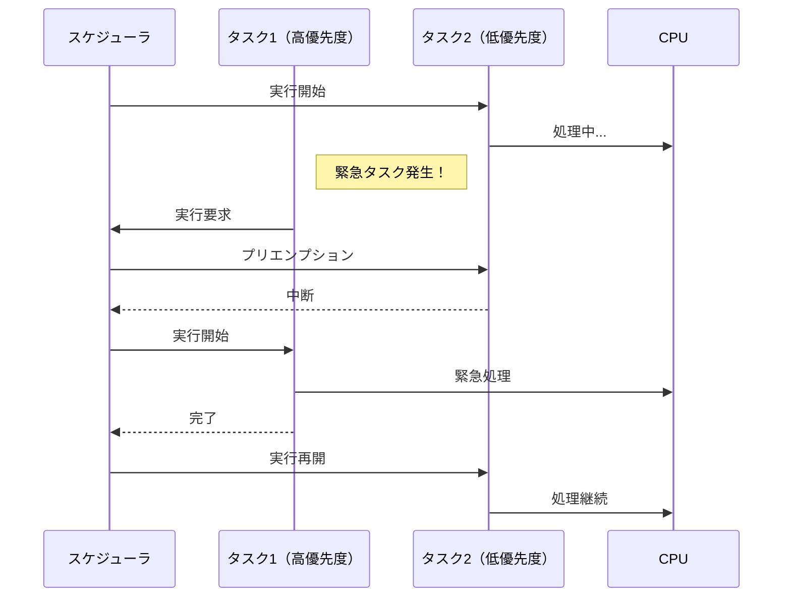
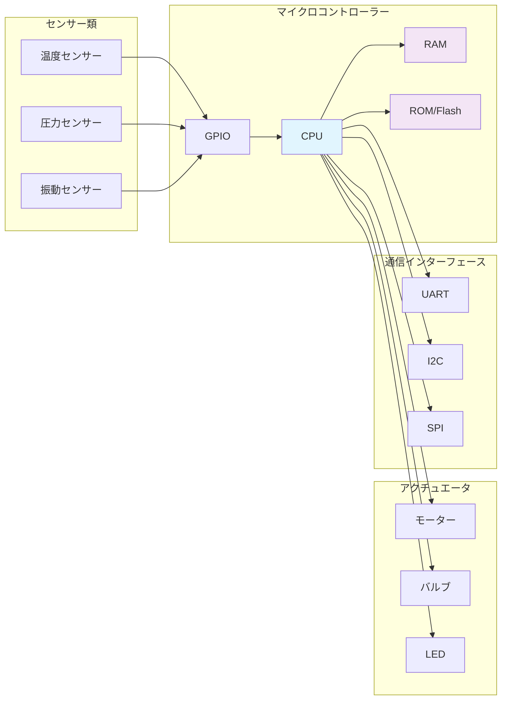

# 第4章: リアルタイムシステム

リアルタイムシステムの概念を学び、Mermaid図表を使ってシステム構成を理解します。

## リアルタイムシステムの分類

**図4-1: リアルタイムシステムの分類**

!!! warning "ハードリアルタイムシステム"
    デッドラインを1回でも守れないとシステム全体が破綻します。
    例：航空機の制御システム、原子力発電所の制御

!!! info "ソフトリアルタイムシステム"
    デッドラインを時々守れなくても、品質が低下するだけです。
    例：動画ストリーミング、オンラインゲーム

## タスクスケジューリング

**図4-2: タスクスケジューリングの流れ**

## 組み込みシステムアーキテクチャ

**図4-3: 典型的な組み込みシステム構成**

## スケジューリングアルゴリズム

**図4-4: 優先度ベーススケジューリング**

```mermaid
gantt
    title 優先度ベーススケジューリング
    dateFormat X
    axisFormat %s
    
    section 高優先度タスク
    タスクA（優先度1）    :active, a1, 0, 2
    タスクA（優先度1）    :active, a2, 5, 3
    
    section 中優先度タスク
    タスクB（優先度2）    :b1, 2, 2
    タスクB（優先度2）    :b2, 8, 2
    
    section 低優先度タスク
    タスクC（優先度3）    :c1, 4, 1
    タスクC（優先度3）    :c2, 10, 2

```

## まとめ

!!! note "第4章の要点"
    - リアルタイムシステムには「ハード」と「ソフト」の2種類がある
    - デッドラインの厳格さが異なる
    - プリエンプションにより優先度の高いタスクが実行される
    - スケジューリングアルゴリズムがシステムの性能を左右する
    - Mermaid図表により複雑なシステムを視覚的に理解できる
