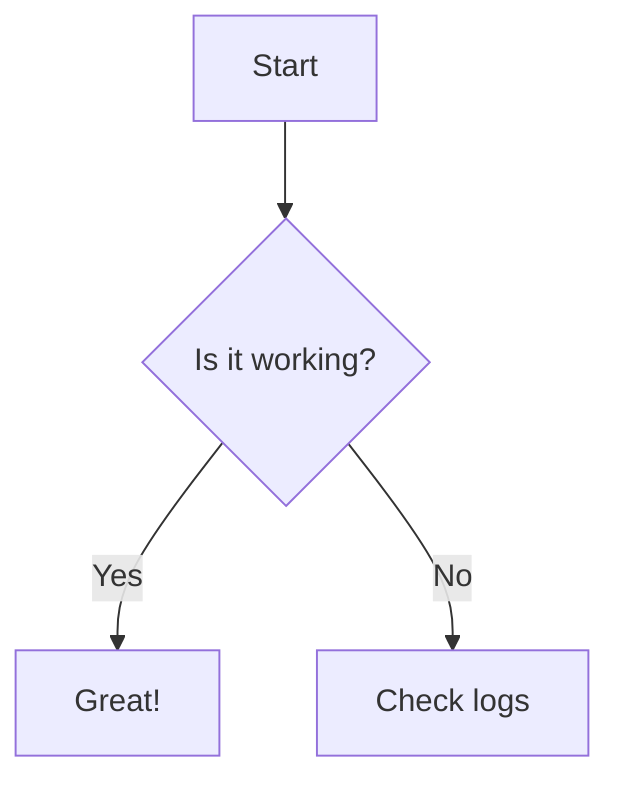

# 第4章 高度なビジュアル要素とインタラクション

## 1. Mermaid.jsによる図表作成

Mermaid構文から、フローチャートやシーケンス図を直接生成する機能のテストです。

## 2. インタラクティブグラフ (Plotly)

ユーザーが操作できるインタラクティブなグラフのテストです。これらはPlotly.jsを利用して描画されます。

**状態遷移グラフ：ボタンをクリックすると、表示されるデータが切り替わります。**

<iframe src="../../charts/interactive_chart.html" width="100%"  style="border: 1px solid #ddd; border-radius: 4px;" scrolling="no" class="auto-height-iframe"></iframe>

**ドロップダウンフィルタ：ドロップダウンメニューから表示するデータセットを選択できます。**

<iframe src="../../charts/interactive_chart.html" width="100%"  style="border: 1px solid #ddd; border-radius: 4px;" scrolling="no" class="auto-height-iframe"></iframe>

## 3. アニメーションGIF

複数のデータフレームからアニメーションGIFを生成する機能のテストです。

**データ変化のアニメーション**

## 4. その他のCore機能

新しく追加されたCore機能の呼び出しテストです。

!!! note "学習オブジェクトの呼び出し"
    ↓ここに`sample_object.yml`の内容が展開されるはずです。

!!! success "学習オブジェクトの展開に成功しました！"
    この内容は `src/learning_objects/sample_object.yml` から動的に読み込まれています。

このように、複数のページで再利用したいコンテンツ部品を「学習オブジェクト」として管理できます。

---

## 5. クイズ機能テスト

このセクションでは、クイズ機能の動作を確認します。

??? info "フィードバック"
    この章についてのご意見・ご質問がございましたら、[こちらのフォーム](https://docs.google.com/forms/d/e/1FAIpQLSdzs_12345/viewform?usp=sf_link)からお聞かせください。
