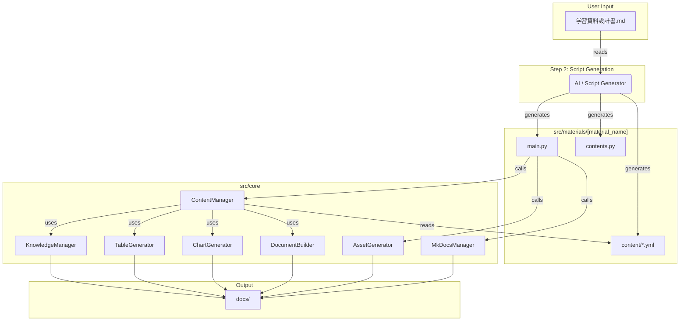

# Core機能 詳細仕様書 (v2.0)

## 0. はじめに

このドキュメントは、`src/core`フレームワークを保守・拡張する開発者（AIを含む）を対象としています。

**目的:** 各モジュールの内部動作、API仕様、設計意図、設定箇所を「レビュー仕様書」レベルの粒度で明確にし、迅速かつ安全な開発を可能にすること。

---

## 1. 全体アーキテクチャとデータフロー

本フレームワークは、`PROJECT_BLUEPRINT.md`に定義された「YAML駆動」「関心の分離」「Core機能への集約」の三大原則に基づいています。

データフローの概要は以下の通りです。



1.  **設計書 (Input):** `学習資料設計書.md`に教材の仕様を定義します。
2.  **スクリプト生成 (Generation):** AIまたはスクリプトが設計書を読み、教材固有のファイル群（`main.py`, `contents.py`, `content/*.yml`）を`src/materials/`配下に生成します。
3.  **ビルド実行 (Execution):** `main.py`がビルドの起点となり、`src/core`の各モジュールを呼び出します。
4.  **コンテンツ生成 (Contents):** `ContentManager`が中核となり、YAMLを解析して`DocumentBuilder`や`ChartGenerator`等を駆使し、MarkdownページやHTMLコンポーネントを生成します。
5.  **成果物 (Output):** 全ての成果物は`docs/`ディレクトリに出力されます。

---

## 2. モジュール別 詳細仕様

### 2.1. `knowledge_manager.py`

#### 2.1.1. 責務
- 専門用語、FAQ、TIPSといった教材横断的な知識情報を一元管理する。
- 用語集、FAQ、TIPSページのMarkdownを生成する。
- テキスト中の専門用語に、自動でツールチップを付与するHTMLを生成する。

<<<<<<< HEAD
#### 2.1.2. アーキテクチャ上の重要な実装詳細

**循環インポート問題の解決:**
- `KnowledgeManager`と`DocumentBuilder`間に循環依存が発生していたため、遅延インポート方式を採用。
- `DocumentBuilder`のインスタンス化を`_get_doc_builder()`メソッドで遅延実行し、初回呼び出し時にのみインポートを行う。
- これにより、モジュール読み込み時の循環参照を回避しつつ、機能の利用時には正常に動作する設計を実現。

```python
def _get_doc_builder(self):
    """DocumentBuilderを遅延初期化で取得"""
    if self.doc_builder is None:
        from .document_builder import DocumentBuilder
        self.doc_builder = DocumentBuilder(self.output_dir)
    return self.doc_builder
```

=======
>>>>>>> dbde2096846e5b4398413351225cc5f784d336f1
#### 2.1.2. 主要機能と実装詳細

**機能: ツールチップの自動付与**

- **目的:** 本文中の専門用語にマウスオーバーすると、その定義がポップアップ表示されるようにする。
- **YAMLでの使い方:**
    1.  `content/terms.yml` にて、`term`, `definition`, `category` を持つ用語を定義する。
    2.  章のYAMLファイル (`chapterN.yml`) 内の `type: text` ブロックに `terms: "キー"` を指定する。このキーにマッチする用語セットがツールチップ付与の対象となる。（現状の実装では、`get_terms_for_chapter`メソッド内で章タイトルとの部分一致で判定している）
- **実装詳細:**
    - **担当メソッド:** `DocumentBuilder.add_paragraph_with_tooltips(text, terms_info)`
    - **動作フロー:**
        1.  `KnowledgeManager`が保持する全用語の中から、`terms_info`に含まれる用語を対象とする。
        2.  `text`（段落の原文）の中から、対象となる用語の文字列を検索する。
        3.  マッチした用語を、`<span class="custom-tooltip" data-tooltip="定義文">用語</span>` というHTMLタグで置換する。
        4.  `data-tooltip`属性に格納される定義文は、`html.escape()`でエスケープされ、改行は`&#10;`に変換される。
    - **スタイル設定:**
        - **HTMLクラス:** `.custom-tooltip`
        - **CSS定義場所:** `asset_generator.py` の `_get_base_css_template()` メソッド内で定義されるCSS文字列。
        - **具体的なスタイル:** 点線の下線が引かれ、マウスオーバーでカーソルが`help`になる。ポップアップ部分（`::before`疑似要素）の背景色、文字色、パディング、角丸などが設定される。
        - **設定値の変更:** スタイルの元となる色などの値は、`asset_generator.py`の`_get_learning_material_css_template()`内の`variables`辞書で変更可能。

---

### 2.2. `document_builder.py`

#### 2.2.1. 責務
- Markdownの基本要素（見出し、リスト等）およびMkDocs Materialが提供するリッチなコンポーネント（注釈、タブ等）の構文を生成する。
- 生成したMarkdownコンテンツを内部バッファに保持し、最終的にファイルとして出力する。

#### 2.2.2. 主要機能と実装詳細

**機能: Admonition（注釈）ブロックの生成**

- **目的:** 「ノート」「ヒント」「警告」など、読者の注意を引くための囲み記事を生成する。
- **YAMLでの使い方:**
    - `type: admonition`
    - `admonition_type` (String): `note`, `tip`, `warning`など。
    - `title` (String): 注釈のタイトル。
    - `text` (String): 注釈の本文。
    - `collapsible` (Boolean): `true`にすると折りたたみ可能になる。
- **実装詳細:**
    - **担当メソッド:** `add_admonition(type, title, content, collapsible)`
    - **ヘルパー関数:** `utils.generate_admonition_markdown()`
    - **動作フロー:**
        1.  `collapsible`の値に応じて、Markdownのプレフィックスを`!!!`（固定）または`???`（折りたたみ）に決定する。
        2.  `f'{prefix} {type} "{title}"'` という形式で1行目を生成。
        3.  `content`（本文）の各行の先頭に4つのスペースをインデントとして付与する。
        4.  結合したMarkdown文字列を内部バッファに追加する。
    - **スタイル設定:**
        - スタイルはMkDocs Materialテーマがデフォルトで提供するものに依存する。各タイプ（`note`, `tip`等）に応じた色やアイコンはテーマ側で定義済み。

**機能: インタラクティブなクイズの生成**

- **目的:** 単一選択、複数選択、カテゴリ分けといったインタラクティブなクイズをHTML/JavaScriptでページに埋め込む。
- **YAMLでの使い方:**
    - `type: single_choice_quiz` / `multiple_choice_quiz` / `categorization_quiz`
    - `quiz_data` (Dict): 問題、選択肢、正解、解説などを含む辞書。
- **実装詳細:**
    - **担当メソッド:** `add_single_choice_quiz()`, `add_multiple_choice_quiz()`, `add_categorization_quiz()`
    - **動作フロー:**
        1.  各メソッドは、`quiz_data`を基に、クイズの骨格となるHTML（`<div class="quiz-container ...">`）を生成する。
        2.  問題文、選択肢（ラジオボタンやチェックボックス）、解答確認ボタンなどがHTMLとして構築される。
        3.  正解や解説といった、答え合わせに必要なデータは、`<script>`タグ内に`window.quizData`のようなグローバルJavaScriptオブジェクトとして埋め込まれる。
<<<<<<< HEAD
    - **JavaScript生成の安全性:**
        - 2025年8月26日に修正: f-string内での複数行文字列生成でSyntaxErrorが発生していた問題を解決。
        - 現在は文字列の結合方式を採用し、JavaScript埋め込みの際のエスケープ処理を`_escape_js_string()`メソッドで安全に行う。
        - 各行を個別に結合することで、改行や引用符のエスケープ問題を回避。
=======
>>>>>>> dbde2096846e5b4398413351225cc5f784d336f1
    - **スタイルと動作:**
        - **HTMLクラス:** `.quiz-container`, `.quiz-option`, `.correct`, `.incorrect`など。
        - **CSS定義場所:** `asset_generator.py`の`_get_base_css_template()`内で定義。正解・不正解時の背景色などが設定されている。
        - **JSロジック:** `asset_generator.py`の`_get_interactive_js_template()`内で、各クイズの動作ロジック（選択肢の制御、答え合わせ、結果表示など）が定義されている。`checkSingleChoice()`のようなグローバル関数がHTMLの`onclick`属性から呼び出される。

<<<<<<< HEAD
**機能: フィードバックフォームの生成**

- **目的:** 各章の最後に学習者からのフィードバックを収集するフォームリンクを統一形式で埋め込む。
- **YAMLでの使い方:**
    - コンテンツ生成の最後に`add_feedback_form(form_url, title)`が自動的に呼び出される（`content_manager.py`の`_generate_chapter_from_data`メソッド内）。
- **実装詳細:**
    - **担当メソッド:** `add_feedback_form(form_url: str, title: str = "フィードバック")`
    - **動作フロー:**
        1. `add_admonition()`メソッドを内部的に呼び出し、`info`タイプの折りたたみ可能なAdmonitionを生成。
        2. フォームへのリンクを含む定型文をAdmonitionの内容として設定。
        3. デフォルトでは折りたたみ状態（`collapsible=True`）で表示され、ユーザーが必要時にのみ展開できる。

=======
>>>>>>> dbde2096846e5b4398413351225cc5f784d336f1
---
### 2.3. `asset_generator.py`

#### 2.3.1. 責務
- 教材サイト全体で使用される静的アセットファイル（CSS, JavaScript）を、テンプレートや設定に基づいて動的に生成・管理する。
- 複数の配色テーマ（デフォルト, ダークモード等）に対応したCSSを生成する。
- 生成したアセットの情報をマニフェストファイルとして出力し、管理を容易にする。

#### 2.3.2. 主要機能と実装詳細

**機能: テーマに基づいたCSSの動的生成**

- **目的:** サイトの配色テーマ（デフォルト、ダーク、ハイコントラスト）を切り替えられるように、それぞれのテーマに対応したCSSファイルを生成する。
- **YAMLでの使い方:** この機能はYAMLから直接利用されず、`main.py`等のビルドスクリプトから`AssetGenerator`のメソッドが呼び出されることで実行される。
- **実装詳細:**
    - **担当メソッド:** `generate_theme_variations(base_template: str)`
    - **動作フロー:**
        1. メソッド内にハードコードされた`themes`辞書（`default`, `dark`, `high_contrast`のキーを持つ）をループ処理する。
        2. 各テーマの変数（`primary_color`, `background_color`等）を`generate_asset()`メソッドに渡す。
        3. `generate_asset()`は、`_get_base_css_template()`で定義された基本CSSテンプレート内のプレースホルダー（例: `{primary_color}`）をテーマ変数の値で置換する。
        4. 置換後のCSSコンテンツを、テーマ名のついたファイル（例: `custom_dark.css`）として`docs/`ディレクトリに書き出す。
    - **スタイル設定:**
        - **ベースCSSテンプレート:** `_get_base_css_template()`メソッド内に文字列として定義されている。サイトの基本レイアウトやコンポーネントのスタイルはここで定義される。
        - **テーマ毎の配色:** `generate_theme_variations()`メソッド内の`themes`辞書で定義されている。新しいテーマを追加する場合は、この辞書に新しいキーと配色の変数を追加する。

**機能: アセットマニフェストの出力**

- **目的:** どのビルドプロセスで、どのテンプレートと変数を使ってアセットファイルが生成されたかをJSON形式で記録し、トレーサビリティとデバッグの容易性を確保する。
- **実装詳細:**
    - **担当メソッド:** `export_asset_manifest()`
    - **動作フロー:**
        1. `generate_asset()`や`write_raw_asset()`が呼び出されるたびに、`self.generated_assets`辞書に生成情報（ファイル名, タイプ, テンプレート名, パス, 使用変数）が記録される。
        2. `export_asset_manifest()`が呼び出されると、この`self.generated_assets`の内容を整形し、`docs/asset_manifest.json`として書き出す。
    - **設定箇所:** 出力ファイル名は`docs/asset_manifest.json`に固定されている。

---
### 2.4. `chart_generator.py`

#### 2.4.1. 責務
- MatplotlibやPlotlyといったライブラリを内部的に利用し、YAMLで定義されたデータから静的・動的なグラフをHTMLファイルとして生成する。
- 生成されたHTMLは、Markdownページに`iframe`で埋め込んで利用されることを想定している。

#### 2.4.2. 主要機能と実装詳細

**機能: 各種グラフのHTMLファイル生成**

- **目的:** 折れ線グラフ、棒グラフ、円グラフ、散布図、インタラクティブチャートなどを、単体のHTMLファイルとして出力する。
- **YAMLでの使い方:**
    - `type: chart`
    - `chart_type` (String): `line`, `bar`, `pie`, `scatter`, `interactive` などを指定。
    - `data` (Dict) または `data_source` (String): グラフの元データを直接記述するか、`data/`配下のCSVファイル名を指定する。
    - `config` (Dict): グラフのタイトル、軸ラベル、出力ファイル名、`use_plotly` (Boolean) などの設定を行う。
- **実装詳細:**
    - **担当メソッド:** `create_simple_line_chart()`, `create_bar_chart()`, `create_pie_chart()`, `create_interactive_plotly_chart()` など、グラフの種類ごとに専用のメソッドが用意されている。
    - **動作フロー (Plotlyの場合):**
        1. `config`で`use_plotly: true`が指定されている場合に実行される。
        2. `plotly.graph_objects` を利用して `Figure` オブジェクトを構築する。
        3. `fig.write_html()` メソッドを呼び出し、インタラクティブなJavaScriptを含むHTMLファイルとして直接出力する。
    - **動作フロー (Matplotlibの場合):**
        1. `use_plotly`が指定されていない場合のデフォルト動作。
        2. `matplotlib.pyplot` を利用して `Figure` オブジェクトを構築する。
        3. プライベートメソッド `_save_mpl_figure_to_html()` が呼び出される。
        4. このメソッドは、グラフをPNG画像としてメモリ上のバッファに保存し、それを**Base64エンコード**する。
        5. エンコードされた画像データを `` タグに埋め込んだ、自己完結型のHTMLページを生成して出力する。
    - **スタイル設定:**
        - **日本語フォント:** `__init__`時に`utils.apply_matplotlib_japanese_font()`が呼び出され、`config.py`で定義された日本語フォントがMatplotlibに適用される。
        - **基本スタイル:** `__init__`時に`config.BASE_CHART_STYLES`から、DPI、figsize、フォントサイズ、線の太さといったデフォルトスタイルを読み込む。
        - **配色:** `config.GLOBAL_COLORS`から`info`などのキーで色情報を取得し、グラフの要素（棒、マーカーなど）に適用する。

---
### 2.5. `table_generator.py`

#### 2.5.1. 責務
- Pandas DataFrameを内部的に利用し、YAMLで定義されたデータからCSSで整形されたテーブルをHTMLファイルとして生成する。
- 基本的なテーブル、比較表、横スクロール可能な幅広テーブルなど、複数の形式に対応する。

#### 2.5.2. 主要機能と実装詳細

**機能: スタイル付きテーブルのHTMLファイル生成**

- **目的:** リスト形式で定義されたデータを、見やすくスタイリングされたHTMLテーブルに変換し、単体のHTMLファイルとして出力する。これにより、Markdownページに`iframe`で埋め込み可能になる。
- **YAMLでの使い方:**
    - `type: table`
    - `table_type` (String): `basic` (基本), `comparison` (比較表), `wide` (横スクロール) などを指定。
    - `headers` (List[String]): テーブルのヘッダー（列名）。
    - `rows` (List[List]): テーブルの各行のデータ。
    - `title` (String), `filename` (String): テーブルのタイトルと出力ファイル名。
- **実装詳細:**
    - **担当メソッド:** `create_basic_table()`, `create_comparison_table()`
    - **動作フロー:**
        1.  引数で受け取った `headers` と `rows` (または `categories`, `items`, `data`) から `pandas.DataFrame` を作成する。
        2.  プライベートメソッド `_generate_html_table_string()` が呼び出される。
        3.  このメソッドは、まずDataFrameの各セルの値を `html.escape()` で安全な文字列に変換する。
        4.  DataFrameの `to_html()` メソッドを使い、基本的な `<table>` 構造を生成する。
        5.  次に、`config.BASE_TABLE_STYLES` や引数の `custom_styles` から取得したスタイル設定（ヘッダーの背景色、セルのパディング、フォントサイズ等）を、`<style>` タグ内のCSSとして文字列で生成する。
        6.  最終的に、生成したCSSとテーブル本体を結合し、完全なHTMLドキュメント文字列を構築して呼び出し元に返す。
        7.  呼び出し元の `create_...` メソッドは、返されたHTML文字列をファイルに書き出す。
    - **スタイル設定:**
        - **基本スタイル:** `__init__` 時に `config.BASE_TABLE_STYLES` から、デフォルトのCSSクラス名、ヘッダー色、ボーダー色、偶数行・奇数行の背景色などを読み込む。
        - **カスタムスタイル:** `create_..._table()` メソッドの `custom_styles` 引数に辞書を渡すことで、ベースとなるスタイルを上書きできる。
        - **幅広テーブル:** `table_type: wide` が指定された場合、`create_basic_table` を呼び出す際に、コンテナに `overflow-x: auto` を適用するためのスタイルが自動的にマージされ、横スクロールが可能になる。

---
### 2.6. `mkdocs_manager.py`

#### 2.6.1. 責務
- `mkdocs.yml`設定ファイルの動的な生成と更新を管理する。
- 教材のナビゲーション構造やカスタム設定を、プログラムから安全に`mkdocs.yml`に反映させる。

#### 2.6.2. 主要機能と実装詳細

**機能: `mkdocs.yml`の完全生成**

- **目的:** 教材のナビゲーション構造やカスタム設定に基づき、`mkdocs.yml`をゼロから自動生成する。これにより、手動での設定ミスを防ぎ、ビルドプロセスを完全に自動化する。
- **実装詳細:**
    - **担当メソッド:** `generate_mkdocs_yml(nav_structure, custom_config, backup)`
    - **動作フロー:**
        1.  `backup=True`の場合、既存の`mkdocs.yml`をタイムスタンプ付きのファイル名（例: `mkdocs.yml.backup_2023-10-27_10-30-00`）でバックアップする。
        2.  `config.py`に定義された`MKDOCS_SITE_CONFIG`から、サイト名、テーマ、Markdown拡張機能などのベース設定を読み込む。
        3.  引数で渡された`nav_structure`（辞書のリスト）を、`nav`キーの値として設定する。
        4.  引数`custom_config`が指定されていれば、`_deep_merge_dict`メソッドを使ってベース設定に再帰的にマージする。
        5.  プライベートメソッド`_auto_detect_assets()`を呼び出し、`docs/`ディレクトリ内をスキャンして`custom*.css`や`custom*.js`といった命名規則のファイルを自動で検出し、`extra_css`および`extra_javascript`のリストに追加する。
        6.  最終的に構築された設定情報の辞書を、`yaml.dump()`を使って`mkdocs.yml`ファイルに書き出す。

**機能: 設定ファイルの検証**

- **目的:** 生成された、あるいは手動で編集された`mkdocs.yml`の内容を検証し、ビルドエラーに繋がりかねない問題（必須キーの欠如、ナビゲーションのリンク切れなど）を事前に検出する。
- **実装詳細:**
    - **担当メソッド:** `validate_config()`
    - **動作フロー:**
        1.  `mkdocs.yml`を読み込む。
        2.  `site_name`, `theme`といった必須フィールドが存在するかをチェックする。
        3.  プライベートメソッド`_validate_nav_files()`を呼び出す。このメソッドは`nav`セクションを再帰的に探索し、記述されているMarkdownファイルが実際に`docs/`配下に存在するかを`os.path.exists`で確認する。
        4.  プライベートメソッド`_validate_asset_files()`を呼び出し、`extra_css`や`extra_javascript`に記述されたファイルが`docs/`配下に存在するかを確認する。
        5.  発見した全ての問題点を`{'errors': [...], 'warnings': [...]}`の形式の辞書で返す。

---
### 2.7. `content_manager.py`

#### 2.7.1. 責務
- `BaseContentManager`という抽象基底クラスとして、教材固有のコンテンツマネージャー（例: `TestMaterialContentManager`）が実装すべき共通のインターフェースと機能を提供する。
- 章ごとのYAMLファイルを解析し、その内容（`type`キー）に応じて、`DocumentBuilder`や`ChartGenerator`など、他の適切なコアモジュールを呼び出すハブとしての役割を担う。

#### 2.7.2. 主要機能と実装詳細

**機能: コンテンツ生成プロセスの統括**

- **目的:** 章のYAMLファイルに記述されたコンテンツブロックのリストを順番に処理し、それに対応するMarkdownやHTMLコンポーネントを生成・組み立てる一連のプロセスを管理する。
- **実装詳細:**
    - **担当クラス:** `BaseContentManager` (ABC - 抽象基底クラス)
    - **主要メソッド:**
        - `__init__(...)`: `DocumentBuilder`, `ChartGenerator`, `TableGenerator`, `KnowledgeManager`のインスタンスを生成し、プロパティとして保持する。
        - `load_chapter_from_yaml(filename)`: `src/materials/{教材名}/content/`ディレクトリから、指定されたYAMLファイルを読み込み、Pythonの辞書として返す。
        - `_process_content_list(contents, ...)`: 章YAML内の`contents`リストをループ処理する、コンテンツ生成の心臓部。リスト内の各要素の`type`キーの値を見て、`if/elif`文で処理を分岐させ、対応する`_process_...`メソッドや`DocumentBuilder`のメソッドを呼び出す。
        - `_process_chart(config, ...)`: `type: chart`の場合に呼ばれ、YAML内の設定を`ChartGenerator`の適切なメソッドに渡してグラフHTMLの生成を指示する。
        - `_process_table(config, ...)`: `type: table`の場合に呼ばれ、`TableGenerator`に処理を委譲する。
        - `generate_content()`: **抽象メソッド**。このメソッドは基底クラスでは実装されず、各教材固有のマネージャークラス（例: `src/materials/test_material/contents.py`）で**必ずオーバーライド**される。教材全体のビルドフロー（どのYAMLをどの順番で処理し、どのファイル名で保存するかなど）を定義する役割を持つ。

**機能: 学習オブジェクトの展開 (コンテンツの再利用)**

- **目的:** `type: learning_object`が指定された際に、`src/learning_objects/`配下に置かれた共通部品化されたYAMLコンテンツをその場に展開し、コンテンツの再利用を促進する。
- **YAMLでの使い方:**
    - `type: learning_object`
    - `id` (String): `src/learning_objects/`ディレクトリにあるYAMLファイルの名前（拡張子なし）。
- **実装詳細:**
    - **担当メソッド:** `_expand_learning_object(item, ...)`
    - **動作フロー:**
        1.  `item`辞書から`id`キーの値を取得する。
        2.  `src/learning_objects/{id}.yml`というパスを構築し、そのYAMLファイルを読み込む。
        3.  読み込んだYAMLデータから`contents`キーの値（コンテンツブロックのリスト）を取得する。
        4.  取得した`contents`リストを引数として、`_process_content_list()`を**再帰的に呼び出す**。これにより、学習オブジェクトの定義内に、さらに別の学習オブジェクトを含める（ネストする）ことも可能になる。

---
### 2.8. 設定 (`config.py` / `base_config.py`)

#### 2.8.1. 責務
- プロジェクト全体で使用する静的な設定値（パス、定数、デフォルトのスタイル定義など）を一元管理する。
- コード内のマジックナンバーやハードコードされた文字列を排除し、保守性と再利用性を高める。

#### 2.8.2. モジュール構成と設計意図

設定は`base_config.py`と`config.py`の2ファイルに分離されています。これは、設定間の依存関係を整理し、Pythonのモジュール読み込みにおける循環参照エラーを防ぐための設計です。

- **`base_config.py`:**
    - **役割:** 他の`core`モジュールに一切依存しない、最も原始的で基本的な定数を定義します。
    - **読み込み順序:** プロジェクト内で最初に読み込まれることを想定しています。
- **`config.py`:**
    - **役割:** `base_config.py`で定義された定数をインポートし、それらを組み合わせて、より上位の、あるいは利便性の高い設定値を定義します。
    - **読み込み順序:** `base_config.py`が読み込まれた後に、各モジュールから利用されます。

#### 2.8.3. 主要な定義値

**`base_config.py`の主な定義:**

- **`PROJECT_ROOT` (Path):** `Path(__file__).resolve().parents[2]`というロジックで、このファイル自身の場所からプロジェクトのルートディレクトリを動的に特定します。
- **`MEANING_COLORS` (Dict):** `danger`, `warning`, `success`, `info`といった、意味合いを持つ色のHEXコードを定義します。コンポーネントのステータス表示などに使用されます。
- **`MATERIAL_ICONS` (Dict):** Admonitionなどで使用するアイコンのキー（例: `memory`）と、実際のMaterial Design IconsのID（例: `memory`）をマッピングします。
- **`BASE_CHART_STYLES`, `BASE_TABLE_STYLES` (Dict):** `chart_generator`や`table_generator`が使用する、グラフやテーブルのデフォルトスタイル（フォント、色、パディング等）を定義した辞書です。
- **`MKDOCS_SITE_CONFIG` (Dict):** `mkdocs_manager`が`mkdocs.yml`を生成する際の雛形となる巨大な辞書。サイト名、テーマ、Markdown拡張機能、プラグインのデフォルト設定が網羅されています。

**`config.py`の主な定義:**

- **`SYSTEM_CONFIG` (Dict):** システム名、バージョン、最終更新日など、システム自体のメタ情報を定義します。
- **`FILE_NAMING_PATTERNS` (Dict):** `md_chapter_index`, `html_chart`など、各種出力ファイルの命名規則をフォーマット文字列として定義します。
- **`GLOBAL_COLORS` (Dict):** `MEANING_COLORS`をコピーし、さらに他の色定義を追加した、プロジェクト全体で使用するカラーパレットです。
- **`PATHS` (Dict):** `base_config.PROJECT_ROOT`を基点として、`DOCS_DIR`や`ASSETS_DIR`など、プロジェクト内の主要ディレクトリへの絶対パスを`pathlib.Path`オブジェクトとして構築します。

---
### 2.9. ユーティリティ (`utils.py`)

#### 2.9.1. 責務
- 特定のモジュールに依存せず、プロジェクト内の様々な場所から利用される、汎用的なヘルパー関数を提供する。
- 文字列操作、フォーマット変換、外部ライブラリの定型的な設定など、再利用性の高い処理をカプセル化する。

#### 2.9.2. 主要機能と実装詳細

**機能: `slugify(text)`**

- **目的:** テキスト（特に日本語を含む）を、URLやファイル名として安全なASCII文字列（スラッグ）に変換する。
- **動作フロー:**
    1.  `unicodedata.normalize('NFKC', text)` を使用し、全角英数字や記号などを半角に正規化する。
    2.  内部に持つ簡易的な辞書 `japanese_to_english` を使い、既知の日本語単語（例: 「図解」）を対応する英単語（例: `zukai`）に置換する。
    3.  正規表現 `[^\w\s\-\.]` を使い、英数字、スペース、ハイフン、ドット以外のすべての文字をハイフン `-` に置換する。
    4.  連続する複数のスペースやハイフンを、単一のハイフンにまとめる。
    5.  文字列の先頭と末尾にあるハイフンを削除し、全体を小文字に変換して返す。

**機能: `apply_matplotlib_japanese_font(font_family)`**

- **目的:** `chart_generator`がMatplotlibでグラフを生成する際に、日本語のグラフタイトルやラベルが文字化け（豆腐化）するのを防ぐ。
- **動作フロー:**
    1.  `matplotlib.font_manager`をスキャンし、現在のシステムで利用可能なフォント名のセットを作成する。
    2.  引数`font_family`で渡されたフォント名のリスト（例: `['Meiryo', 'Yu Gothic', ...]`)を優先順位の高い順にループ処理する。
    3.  リスト内のフォント名が、システムで利用可能なフォントのセットに存在するかを確認する。
    4.  最初に見つかった利用可能なフォントを`plt.rcParams['font.family']`に設定し、処理を終了する。
    5.  もしリスト内のフォントが一つも見つからなかった場合は、警告をログに出力し、デフォルトの`sans-serif`にフォールバックする。

**機能: `generate_admonition_markdown(...)` / `generate_tabbed_markdown(...)`**

- **目的:** `document_builder.py`から呼び出され、MkDocs Materialが要求するAdmonition（注釈）やTabbed（タブ）ブロックの、複数行にわたる複雑なMarkdown構文を生成するロジックをカプセル化する。
- **動作フロー:**
    - 引数で受け取ったタイトルやコンテントのリストを基に、`!!!`（Admonition）や`===`（Tab）といったプレフィックスと、Markdownの階層構造で必須となる4スペースのインデントを各行に正しく付与した、単一のMarkdown文字列を組み立てて返す。

---
### 2.10. プラットフォームビルダー (`platform_builder.py`)

#### 2.10.1. 責務
- 単一の教材（material）の枠を超え、複数の教材を横断して処理する、プラットフォームレベルの機能を担当する。
- サイト全体で共有されるグローバルなアセット（例: 総合用語集、全教材を網羅したラーニングパス）を生成する。

#### 2.10.2. 現状と将来の展望

このモジュールは`IMPROVEMENT_PROPOSALS.md`で提案されているものであり、**まだ具体的な実装はされていません。** 現在のファイルには、将来実装されるべき関数の雛形（空の関数）のみが定義されています。以下は、その計画に基づいた、あるべき機能の仕様です。

#### 2.10.3. 主要機能と実装詳細（計画中）

**機能: `generate_global_glossary(materials_dirs, output_path)`**

- **目的:** プロジェクト内に存在する複数の教材ディレクトリ（例: `intro_to_c`, `intro_to_python`）から、それぞれの`content/terms.yml`を横断的にスキャンし、全教材の用語を統合した単一の「総合用語集」ページを生成する。
- **想定される動作フロー:**
    1.  引数で渡された`materials_dirs`のリストをループ処理する。
    2.  各ディレクトリ内で`content/terms.yml`を探し、YAMLとして読み込む。
    3.  全教材から集めた用語データを一つのリストに集約する。その際、重複する用語は定義をマージする、あるいは教材ごとの定義を併記するなどのルールを適用する（このルール自体も、将来的に要仕様定義）。
    4.  集約した用語リストを`KnowledgeManager`のインスタンスに登録する。
    5.  `KnowledgeManager.generate_glossary_markdown()`を呼び出し、単一のMarkdownページを生成する。
    6.  生成されたMarkdownコンテンツを、引数`output_path`で指定されたファイルに保存する。

**機能: `generate_learning_path(materials_dirs, output_path)`**

- **目的:** 各教材の`content/config.yml`に定義された依存関係（例: `prerequisites: ["intro_to_c"]`）を読み取り、教材間の学習順序を示す「ラーニングパス」を生成する。
- **想定される動作フロー:**
    1.  各教材の`content/config.yml`を読み込み、教材名、タイトル、そして依存関係（前提教材や推奨次教材）の情報を抽出する。
    2.  抽出した情報から、教材をノード（点）、依存関係をエッジ（矢印）とする有向グラフをデータとして構築する（例: `networkx`のようなグラフ操作ライブラリの利用を検討）。
    3.  構築したグラフを分析し、学習の推奨順序をリストアップする。
    4.  あるいは、グラフ構造をMermaid.jsの`graph TD`構文のような可視化可能な形式に変換する。
    5.  生成したラーニングパスのデータ（リストまたはMermaid構文）を、引数`output_path`で指定されたファイル（MarkdownまたはJSON）に保存する。

---

## 3. 開発TIPS

### 3.1. ローカルサーバーのバックグラウンド実行

`mkdocs serve`はフォアグラウンドで実行され、ターミナルを占有します。他の作業と並行してサーバーを起動し続けるには、バックグラウンドで実行する必要があります。

**コマンド:**
```shell
start /b mkdocs serve
```

**注意:**
- このコマンドはWindowsのコマンドプロンプト用です。
<<<<<<< HEAD
- バックグラウンドで実行したプロセスを停止するには、タスクマネージャーを開き、`mkdocs.exe`または`python.exe`のプロセスを探して手動で終了させる必要があります。

### 3.2. 開発時の推奨事項

#### 3.2.1. ビルドエラーのデバッグ手順

1. **SyntaxError発生時:**
   - f-string内での複数行文字列や辞書アクセスに注意
   - JavaScript生成部分では文字列結合方式を使用
   - `_escape_js_string()`でエスケープ処理を確実に行う

2. **ImportError発生時:**
   - 循環インポートの可能性を確認
   - 必要に応じて遅延インポート（`_get_doc_builder()`方式）を採用
   - モジュール間の依存関係を整理

3. **KeyError/AttributeError発生時:**
   - YAMLデータの形式変更に伴うキー名の不整合を確認
   - メソッドの実装漏れがないかチェック
   - 複数の辞書キー形式をサポートする実装を検討

#### 3.2.2. 品質保証のガイドライン

- **テスト実行:** 機能追加後は必ず`pytest`でテストスイートを実行
- **ビルド確認:** `python src/materials/test_material/main.py`でビルドが正常完了することを確認
- **動作確認:** `mkdocs serve`でローカルサーバーを起動し、ブラウザで表示・動作を検証
- **ドキュメント更新:** 実装変更時は対応するドキュメント（本書、`IMPROVEMENT_PROPOSALS.md`等）を必ず更新
=======
- バックグラウンドで実行したプロセスを停止するには、タスクマネージャーを開き、`mkdocs.exe`または`python.exe`のプロセスを探して手動で終了させる必要があります。
>>>>>>> dbde2096846e5b4398413351225cc5f784d336f1
